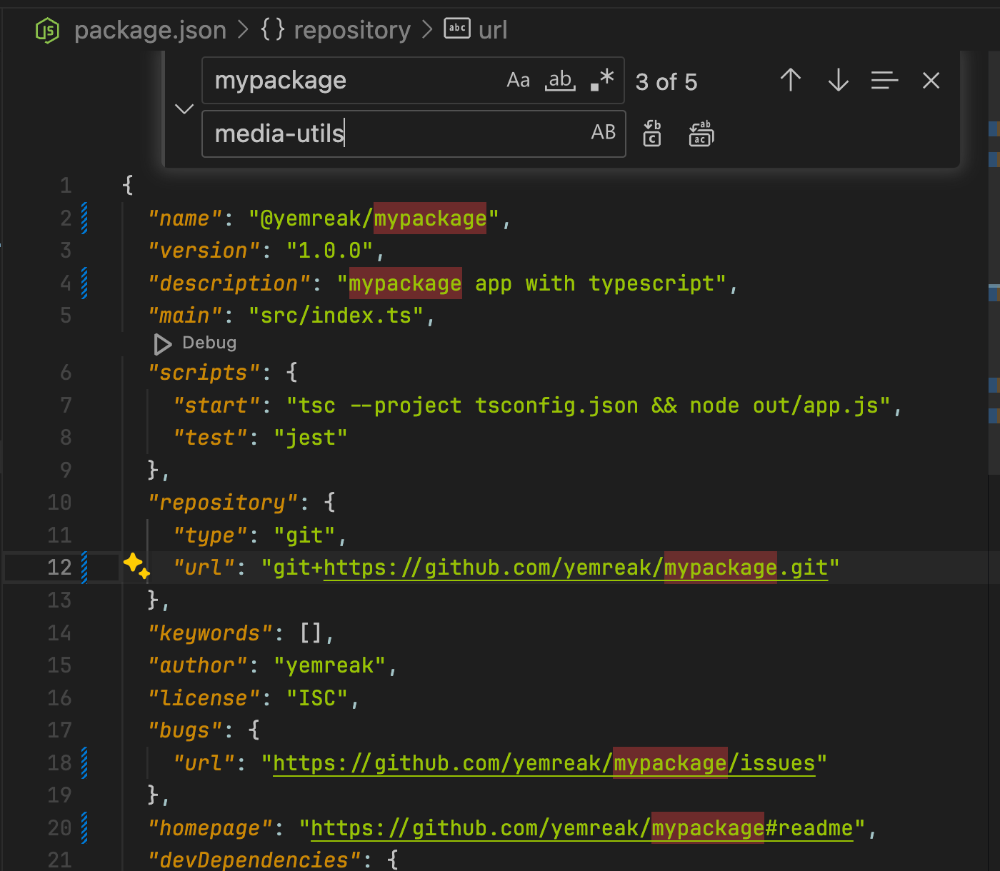

# npm-package-template

## Getting Started

To get started with this npm package template, follow these steps:

1. Clone the repository to your local machine.
2. Navigate to the project directory.
3. In your `package.json`, use VSCode Find and Replace feature to change all instances of 
	- `mypackage` to your own package name
	- `yemreak` to your own author name
	- 
4. Install the dependencies by running the following command:
	```zsh
	npm install
	```
5. To add a new user to npm registry, run:
	```zsh
	npm adduser
	```
6. To publish the package to the **public** npm registry, run:
	```zsh
	npm publish --access public
	```
